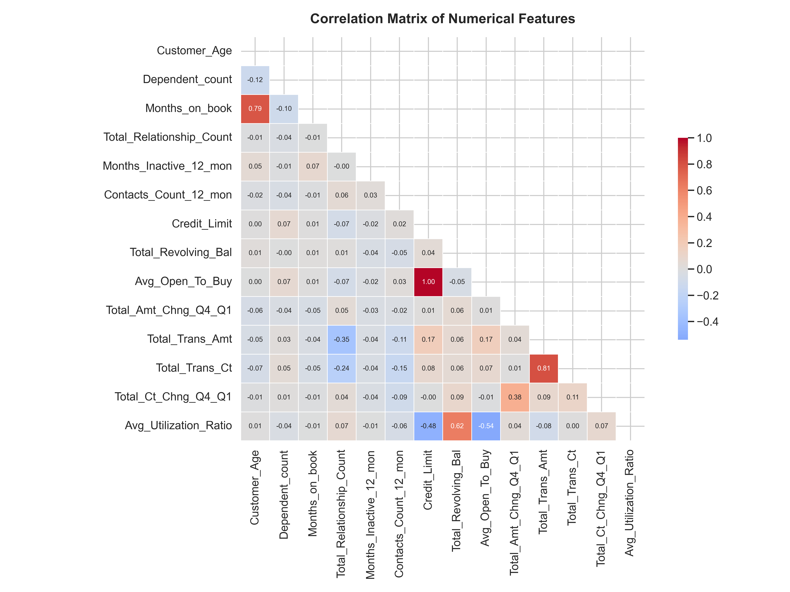

# Credit Card Churn Prediction

## Overview
This project focuses on predicting customer churn for a credit card company. By analyzing customer demographics, account activity, and transaction history, we aim to identify customers at risk of leaving and understand the key drivers of attrition.

The dataset contains information on 10,127 customers, including their age, education, income, and card usage patterns.

## Key Findings
- **Income & Churn:** There is a noticeable variation in churn rates across different income categories.
- **Transaction Count:** Lower transaction counts are strongly associated with higher churn risk.
- **Utilization:** Customers with lower credit utilization ratios are more likely to churn.

## Visualizations
The following visualizations highlight key insights from the data:

### Customer Attrition Distribution

*Distribution of Existing vs. Attrited customers.*

### Correlation Matrix

*Correlation heatmap of numerical features.*

### Churn by Income

*Churn rates across different income brackets.*

### Age Distribution

*Age distribution of customers separated by attrition status.*

## Getting Started

### Prerequisites
- Python 3.8+
- pandas
- matplotlib
- seaborn
- scikit-learn

### Installation
1. Clone the repository:
   ```bash
   git clone https://github.com/PaarthParekh/Credit_Card_Churners.git
   ```
2. Install dependencies:
   ```bash
   pip install pandas matplotlib seaborn scikit-learn
   ```

### Usage
Run the visualization script to generate plots:
```bash
python visualize.py
```
This will create a `plots/` directory with the generated images.

The main analysis is contained in the Jupyter Notebook `churningcustomers.ipynb`.
